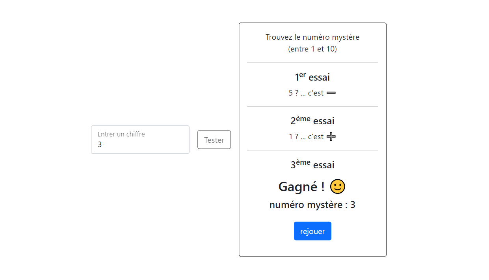

    
    
    
    

# Mystery number

Create a mini-game to guess a mystery number.

## Instructions

- a number is chosen randomly between 1 and 10
- we then have up to 3 tries to guess the mystery number

## Bonus

Provide 3 levels of difficulty :
- easy (3 attempts between 1 and 10)
- medium (2 attempts between 1 and 50)
- hard (1 attempt between 1 and 100)

## Authors

- [Nicolas Herbez](https://github.com/nicolas-herbez)
